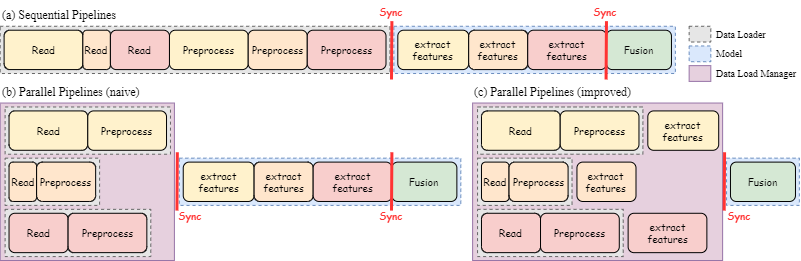

# Improved Multimodal Real-Time Data Loading



This is the repository for the project "Improved Multimodal Real-Time Data Loading" for SNU's SP2023 Big Data and AI Systems course.
We implemented a dataloader for multimodal models that loads, processes, transforms, and encodes each data modality individually, so they can take advantage of parallelism and show increased performance.

## Requirements

- Python 3.10
- PyTorch 2.0.1
- CUDA 11.2

## Quick Start
### Install Requirements

To install, run the following commands in an environment where cuda and a GPU is available:

``` shell
conda create -n mmsys python=3.10
conda activate mmsys
conda install pytorch torchvision torchaudio pytorch-cuda=11.7 -c pytorch -c nvidia
pip install -r requirements.txt
```

### How to use MultimodalDataLoadManager
- This is an example for image-audio multimodal system
``` python
from multimodal_dataloader import MultimodalDataLoadManager, RealTimeDataPipe
from realtime_dataloader import DataLoader as RealTimeDataLoader

# Your multimodal model is here
model = model.cuda()
model.eval()

# Create RealTimeDataPipes and RealTimeDataLoaders
datapipes = {}
dataloaders = {}

datapipes['image'] = RealTimeDataPipe(read_image, preprocess_image)
dataloaders['image'] = RealTimeDataLoader(datapipes['image'], num_workers = 1, batch_size = 1, shuffle = False)

datapipes['audio'] = RealTimeDataPipe(read_audio, preprocess_audio)
dataloaders['image'] = RealTimeDataLoader(datapipes['audio'], num_workers = 1, batch_size = 1, shuffle = False)

# Define feature extractor dictionary
feature_extractors = {}
feature_extractors['image'] = model.extract_feature_image
feature_extractors['audio'] = model.extract_feature_audio

# Create MultimodalDataLoadManager
manager = MultimodalDataLoadManager(
    dataloaders,
    feature_extractors,
)

# Inference loop
for step in range(5):
    features = manager.get_data() # Dict()

    output = model.fusion(features)
    ...
```


## Experiments
### Run Synthetic Experiments
``` shell
python benchmark_synthetic.py --config <config_file> [--num_modes <num_modes>]
```
All configs for the synthetic experiments are in [configs/synthetic](configs/synthetic) folder

-  For reproducing the results on Figure 3 in the reports
``` shell
python scripts/run_synthetic_resnet.py
```
- For reproducing the results on Figure 4 in the reports
``` shell
python scripts/run_synthetic_nummodes.py
```

### Run AVSR Experiments

- To run the AVSR experiments, you'll need to install a pretrained AVSR model from their original [model zoo](https://github.com/mpc001/Visual_Speech_Recognition_for_Multiple_Languages#Model-Zoo). Install the AutoAVSR model for Lip Reading Sentences 3 (LRS3) using Audio-visual components. Then, move this model to
```
ASVR/Visual_Speech_Recognition_for_Multiple_Languages/benchmarks/LRS3/models
```
and unzip it.

Then, run the following code to generate a VizTracer log file for the original model:

``` shell
viztracer --log_sparse avsr_demo.py config_filename=configs/LRS3_AV_WER0.9.ini data_filename=../example_videos/aisystems_demo detector=mediapipe parallel=False -o logs/baseline/sequential_avsr_demo.json
```

And for the parallel (our) version:

``` shell
viztracer --log_sparse avsr_demo.py config_filename=configs/LRS3_AV_WER0.9.ini data_filename=../example_videos/aisystems_demo detector=mediapipe parallel=True -o logs/ours/parallel_avsr_demo.json
```

You can then check the loadtimes using 
``` shell
python check_runtime.py -f logs/baseline/sequential_avsr_demo.json

python check_runtime.py -f logs/ours/parallel_avsr_demo.json
```

Note that the load times will be inconsistent; though it is likely our parallel version will run faster, it is not guaranteed. Runtimes will also differ across GPU's. Several runs may required to see average results.

You can also view the VizTracer stack traces and see the parallel vs. sequential traces by running:

``` shell
vizviewer logs/baseline/sequential_avsr_demo.json --port 4112

vizviewer logs/ours/parallel_avsr_demo.json --port 4112
```